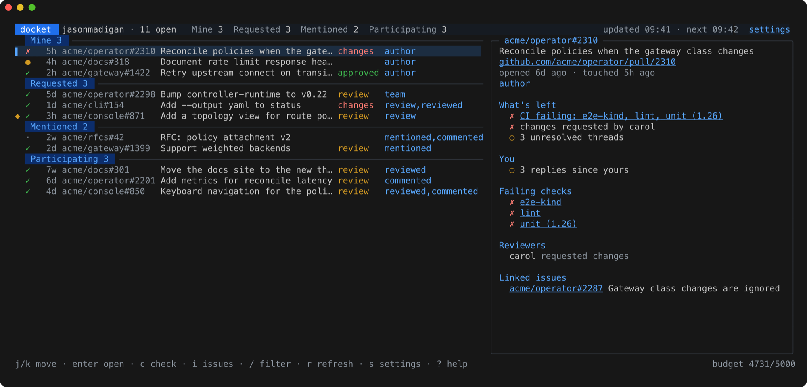
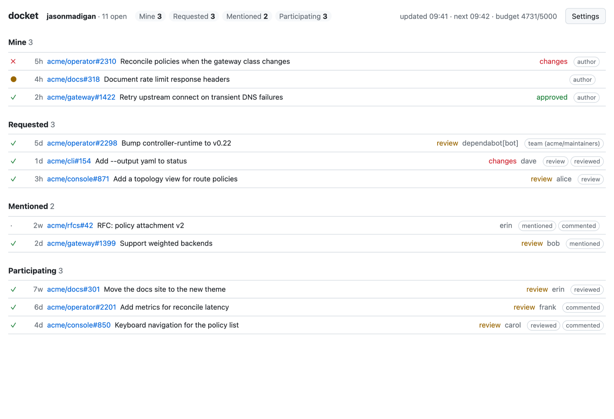
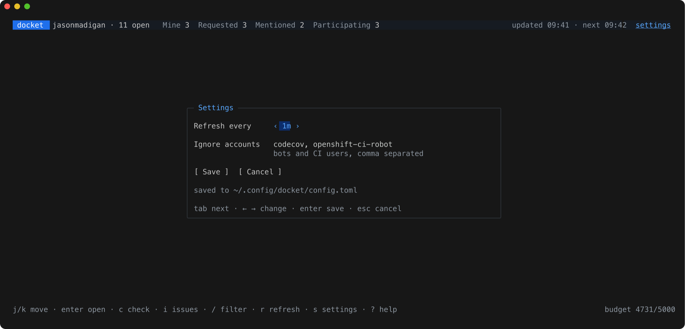

# docket

Every open pull request you're involved in, live in your terminal or a browser tab: CI, what's left before it can merge, linked issues, and how long since anyone touched it.



A PR is listed while it's open and you opened it, were asked to review it (directly or through a team), are assigned to it, were @-mentioned in it, reviewed it or commented on it. Nothing is hidden for being old: in each section the longest-neglected come first, so nothing quietly dies.

## What it shows

- CI: passing, running, or failing and which checks.
- What's left: conflicts, behind base, changes requested and by whom, reviewers still awaited, unresolved threads, or ready to merge.
- Your side: a review asked of you or your team, commits pushed since your review, mentions you haven't answered, replies since your last comment.
- Linked issues, and how long since a person, not a bot, last touched the PR.

It refreshes every minute. The header shows what it's doing while it does it, and `◆` marks PRs that changed since the last refresh until you've looked at them.

## Install

Needs Go 1.26 and the [GitHub CLI](https://cli.github.com/), logged in with `gh auth login`; docket borrows its token.

```sh
go install github.com/jasonmadigan/docket/cmd/docket@latest
```

Runs on macOS and Linux.

## Use

```sh
docket              # terminal UI
docket web --open   # the same in a browser tab, at http://127.0.0.1:7788
docket dump         # print once and exit; --json for scripts
```

| Key | |
|-|-|
| `j` `k`, arrows, wheel | move |
| click | select |
| `enter` | open the PR |
| `c` | open its first failing check |
| `i` | open its linked issues |
| `/` | filter by repo, title, author or tag; `esc` clears |
| `r` | refresh now |
| `s` | settings |
| `?` | help |
| `q` | quit |

PR refs, failing checks and linked issues are links you can click in terminals that support them, such as iTerm2. Over SSH, links are copied to your clipboard instead of opened.

<picture>
  <source media="(prefers-color-scheme: dark)" srcset="docs/img/web-dark.png">
  
</picture>

The web view listens on loopback only. It has no login of its own and refuses requests addressed to any hostname but `localhost`.

## Settings

Press `s` in the terminal, or use Settings in the browser.



- Refresh interval: 30s to 10m from the screens, anything from 10s to 1h by hand.
- Accounts that don't count as people, such as CI bots: their comments don't count as activity or replies.

Settings live in `~/.config/docket/config.toml` (`$XDG_CONFIG_HOME` is honoured) and apply straight away. Edits by hand are picked up while docket runs.

```toml
poll = "1m"
ignore_actors = ["codecov", "openshift-ci-robot"]
```

## Rate limit

A refresh costs a few GraphQL points: one to find your PRs, then roughly one per ten for their detail. Two dozen PRs cost 4 or 5, out of the 5,000 an hour your token shares with everything else using it. With under a tenth left, docket waits for the reset.

## Firewalls

An outbound firewall such as Little Snitch has to let `docket` reach `api.github.com:443`, and may ask again after you rebuild it.

## More

[docs/design.md](docs/design.md) sets out the rules: who counts as a person, what's left, and when a reply counts.

## Licence

[MIT](LICENSE)
